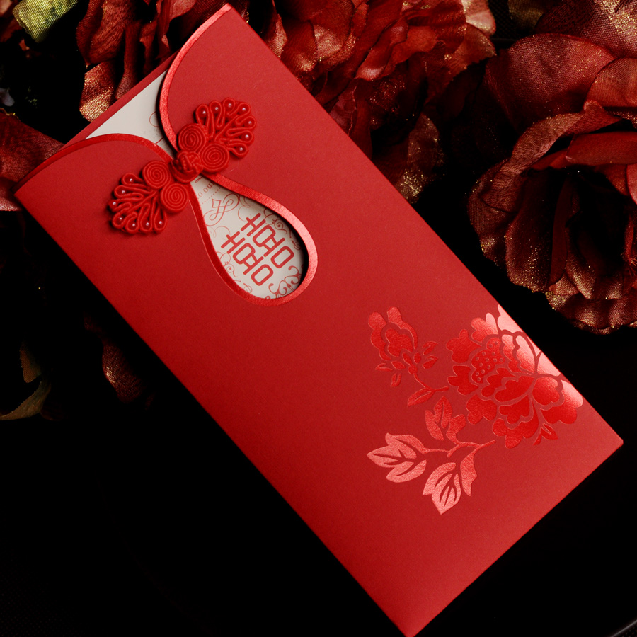
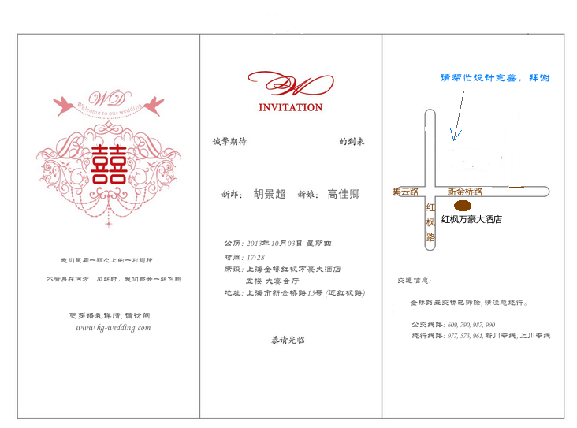

喜帖信息
===================

:作者: 胡景超
:提供: `docutils <http://docutils.sourceforge.net/>`_ 

喜帖外页
---------

内页参考
---------

字体
--------

  - 以隶书为主，体现浑圆饱和感

爱情宣言
---------

::
    
    我们是同一颗心上的一对翅膀，不管身在何方，风起时，我们都会一起飞翔.
    更多婚礼详情，请访问 www.hg-wedding.com

新人名字
---------

  - 新郎: 胡景超
  - 新娘: 高佳卿
  - 名字用圆滑一点的字体，要粗体的

酒店信息
-----------

  - 时间: 2013年10月3日 (农历8月29日) 晚上 17:28
  - 酒席: 上海金桥红枫万豪酒店 五楼 大宴会厅
  - 地址: 新金桥路15号(近红枫路)
  - 以上文字请置于第二页下半部分，*恭请光临* 之后, 字体隶书。

交通信息
-------------

  - 交通信息: 金桥路立交桥已拆除, 请注意绕行。
  - 公交线路: 609, 790, 987, 990 (绕行线路: 977, 573, 961, 新川专线, 上川专线)
  - 第三页上半部请协助制作交通简图，下半部文字部分如上。

地图制作
------------

  - 地图需包含杨高路，红枫路

